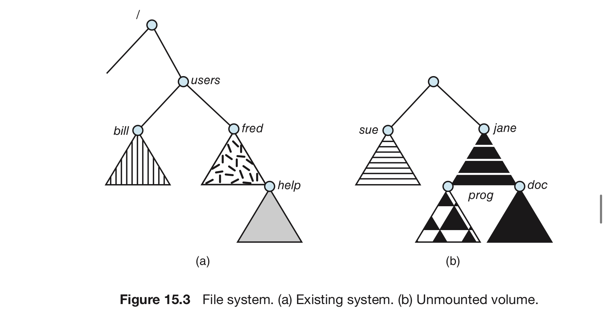
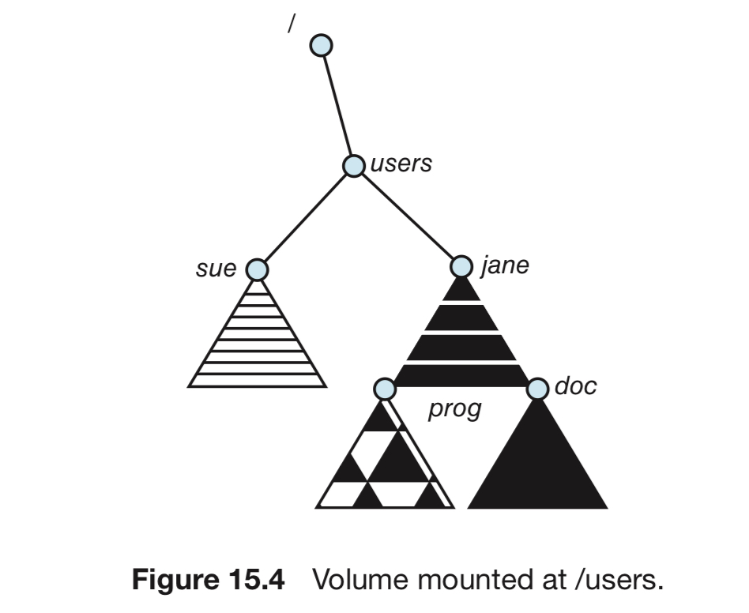

# 2. 파일 시스템 마운팅

## 마운팅이란?

<aside>
💡 사용자가 파일 시스템에 접근할 수 있게끔 파일 시스템을 시스템의 디렉터리 트리에 포함하는 것.

</aside>

디렉터리 구조는 다양한 볼륨으로부터 만들어짐. 

이때, 각 파티션들이 마운트 되어야 파일 시스템 namespace 안에서 이용 가능함.

## 마운트 과정

1. 운영체제에 파일 구조 내의 위치 (= 마운트 포인트)를 준다.
    1. 이 장소는 비어있는 디렉토리로, 장치 이름과 파일 시스템을 부착할 수 있다.
2. 파일 시스템의 유형을 결정
    1. 장치 구조를 검사한 후 결정할 수도 있다.
3. 장치가 유효한 파일 시스템을 포함하는지를 확인
    1. 장치 드라이버가 장치 디렉터리를 읽는다.
    2. 디렉터리가 유효한 포맷을 가지고 있는지 확인하도록 요청
4. 운영체제는 파일 시스템이 지정된 마운트 포인트에 마운트 되었음을 디렉터리 구조에 기록
    1. 운영체제가 디렉터리 구조를 순회하고, 파일 시스템을 적절히 전환하게 해줌
    2. 파일 시스템의 유형도 필요에 따라 전환할 수 있게 해줌

그림 15.3 

▶️ (a) : 기존 파일 시스템

▶️ (b) : /device/dsk에 있는 마운트되지 않은 파일 시스템

그림 15.4

▶️ 15.3의 (b)가 마운트된 모습.

▶️ /device/dsk에 있는 파티션을 /users에 마운트함.

## 의미 부여

시스템은 기능을 명확하게 하기 위해 의미(semantics, 시멘틱)을 부여한다.

- ex. 시스템이 파일을 포함하는 디렉터리에 마운트를 허가하지 않음
- ex. 마운트된 파일 시스템만 그 디렉터리에서 사용할 수 있게 하고 기존 파일들은 언마운트될 때까지 사용할 수 없게 함
- ex. 다른 마운트 포인트에 같은 파일 시스템을 반복적으로 마운트하는 것을 허용
- ex. 파일 시스템 당 한번의 마운트를 허용

## 예시 : macOS

- 시스템이 디스크를 처음 발견 시, macOS는 장치에 존재하는 파일 시스템을 검색
- 발견 시 파일 시스템을 /volume 디렉터리에 자동으로 마운트, 장치 디렉터리에 저장된 파일 시스템의 이름이 붙은 폴더 아이콘을 추가.
- 인제 사용자는 아이콘을 클릭해 새 마운트 된 파일 시스템을 탐색할 수 있음

## 예시 : Windows

- 확장된 2단계 디렉터리 구조를 유지, 장치와 볼륨에는 드라이브 문자가 할당됨.
- 각 볼륨은 드라이브 문자와 연관된 일반적인 그래프 디렉터리 구조를 가짐
- 특정 파일의 경로 : `(드라이브) :\ (path) \ (to) \ (file)`

- 최신 버전에선 유닉스와 마찬하기로 디렉터리 트리의 아무 디렉터리에나 마운트 가능
- 윈도우 운영체제는 부팅 시 발견한 모든 장치에 존재하는 파일 시스템을 자동으로 마운트
    - 유닉스에서는 마운트 명령어가 명시적으로 필요