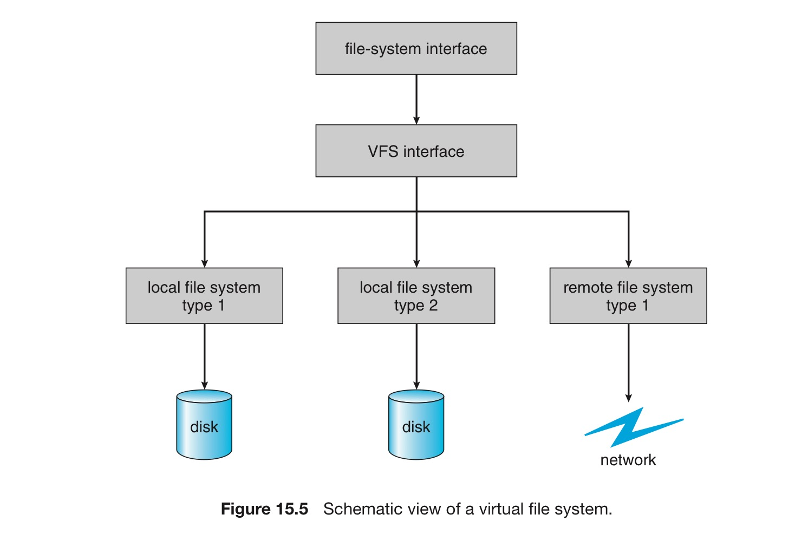

# 5. 가상 파일 시스템

어떻게 운영체제는 여러 유형의 파일 시스템을 하나의 디렉터리 구조로 통합되게 할 수 있는가?

또 어떻게 사용자는 파일 시스템 공간을 탐색하면서 다른 파일 시스템 사이를 이동할 수 있는가?

## 여러 유형의 파일 시스템 구현하기

1. 직접 파일 시스템 여러 개 만들기
2. 객체지향 이용하기 ⇒ 대부분의 운영체제가 만드는 방법
    - 전혀 달라 보이는 파일 시스템도 이를 이용해 같은 구조 안에 포함이 가능
    - 사용자가 로컬 디스크 속 여러 파일 + 네트워크 속 다른 파일에 접근할 수 있는 이유

## 파일 시스템 구현 : 3개의 계층

### 1. 시스템 콜 + 파일 디스크립터

- `open(), read(), write(), close()` 호출
- 파일 디스크립터

### 2. 가상 파일 시스템 (VFS)

VFS 층은 두 가지 중요한 기능을 제공함

1. VFS 인터페이스 층을 명확하게 정의.
    - 이를 통해 파일 시스템의 일반적인 연산을 구현과 분리.
    - VFS 인터페이스에 대한 다른 구현들이 같은 기계상에 공존할 수 있으므로, 다른 형태의 파일 시스템을 지역적으로 마운트함으로써 투명한 접근을 가능하게 함.
2. 네트워크에 속한 모든 파일을 동일한 형태의 파일 객체로 표현
    - vnode라 불리는 파일 표현 구조에 기반을 둠
    - vnode = 네트워크 전체에서 유일한 파일에 대한 수치 지정자를 포함
    - 네트워크 파일 시스템을 지원하려면 전 시스템 상에서 유일해야 함
    - 커널은 각 활성 노드에 대해 하나의 vnode 구조를 가짐.

이를 위해 VFS는 원격 파일과 로컬 파일을 구분.

로컬 파일들은 파일 시스템 유형에 따라 더 세부적으로 구분됨.

VFS는 특정 파일 시스템의 명령을 활성화함으로써 파일 시스템 유형에 따른 로컬 요청을 처리

- 원격 요청에 대해서는 NVS 또는 타 프로토콜 프로시저를 호출함.

파일 핸들은 관련된 vnode로부터 구성, 이들 프로시전에 매개변수로 전달됨.

### 3. 파일 시스템 구현

- 파일 시스템 유형이나 원격 파일 시스템 프로토콜을 구현하는 계층

### 리눅스: VFS 구조

리눅스 VFS를 이루는 4가지 기본 객체 유형

1. inode object : 각 파일을 나타냄
2. file object : 오픈 파일을 나타냄
3. superblock object : 전체 파일 시스템을 나타냄
4. dentry object : 각 디렉터리 엔트리를 나타냄

4가지 각각의 객체 유형에 대해 VFS는 구현 가능한 연산의 집합을 정의함.

이러한 객체 유형에 해당되는 모든 오브젝트는 대응되는 함수 테이블을 가짐

함수 테이블 리스트는 실제 구현된 연산에 대한 처리 함수의 주소를 관리.

ex. 파일 객체에 대한 연산 처리 함수 → `open(), close(), read(), mmap()` 등등

- 특정 파일에 대한 파일 객체의 구현 = 파일 객체에서 정의된 각 함수의 실제 구현된 코드로 구성

따라서 VFS 소프트웨어 레이어는 파일 객체에 대한 연산 시, 적절한 함수를 함수 테이블에서 찾아 수행.

VFS가 직접 파일을 파악하는 것이 아닌, 파일 → VFS → 함수 호출로 이어짐.